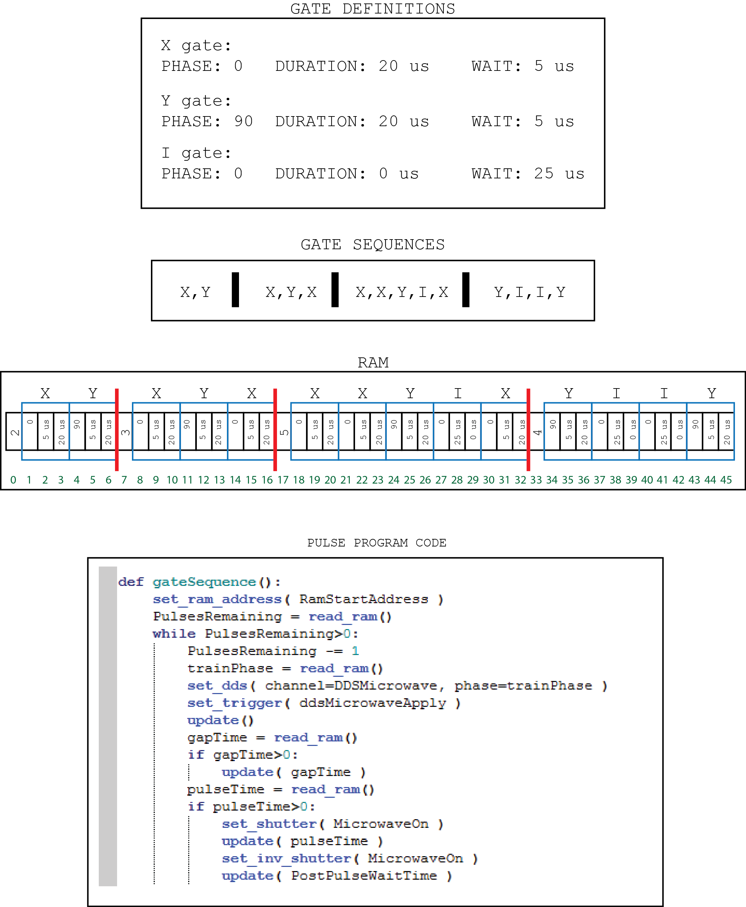

.. include:: inlineImages.include

.. _GateSequences:

Gate Sequences
==============

The gate sequence interface is intended to enable creating long sequences of gates for applications such as randomized benchmarking, gate set tomography, or long algorithms. The idea is to create two files. The first is the *gate definition* file, which is an XML file which defines a set of named operations (here called 'gates,'). You can see an example in \\IonControl\\config\\GateSequences\\GateDefinition.xml. In this file, a *pulse* is defined as something that sets a phase, a pulse time, and a wait time. A *gate* is then a pulse with a specified phase, pulse time, and wait time. The two times are in turn specified in terms of *gateTime* and *piTime* which are pulse program parameters.

The second file is the *gate sequence* file. You can see an example in \\IonControl\\config\\GateSequences\\GateSequenceDefinition.xml. Here, a list of gate sequences are specified using the gate names that appeared in GateDefinition.xml.

On the scan control interface, click the blue "Gate Sequences" bar at the bottom to open the Gate Sequences control panel. If the "Gate Sets in RAM" checkbox is checked, gate sequences will be written to RAM.

.. warning:: If the write RAM checkbox in the pulse program window is checked, that will overwrite the RAM set here!

This figure illustrates what exactly is written to the RAM and how it is intended to be used in the pulse program.

   Illustration of how a gate sequence works. The Gate definitions file specifies a set of parameters defined by each named gate. The gate sequences file specifies a list of gate sequences. The RAM is then written as shown in the illustration. Each rectangle represents one cell of RAM memory, with the address of that cell shown below it. The blue boxes and red lines indicate the boundaries of gates and gate sequences, respectively. Each gate sequences takes a block of RAM, where the first element indicates how many gates are in the sequence, and the subsequent elements are the gates of the sequence. The pulse program code then reads out that information and executes the set of gates. Finally, if a gate sequence scan is selected from the scan control drop down menu, the RamStartAddress parameter will be scanned, and the scan values it takes will correspond to the divisions between each gate sequence (i.e. the red lines in the drawing).

In the gate sequences GUI, there are three combo boxes:

- Start address param
   This is the pulse program parameter that is used as the RAM start address, which is declared with the **address** keyword in the pulse program.

- Gate Definition
   The gate definition file, discussed above.

- Gate Sequence List
   The gate sequence file, discussed above.

There are also two radio buttons:

- Full List
   If this is selected, the full list of gate sequences will be uploaded, as discussed above.

- Gate
   If Gate is selected, the gate sequence list is ignored. Instead, the gates listed in the text box will be executed, and repeated the number of times specified in the spinbox. For example, if there are named gates x and y, you could type in "x,y,x,x,y". If the spinbox is set to 10, this pattern would be repeated 10 times.

Back in the scan control, the "Gate Sequence Scan" will scan the RAM start address in such a way as to scan through all of the gate sequences.