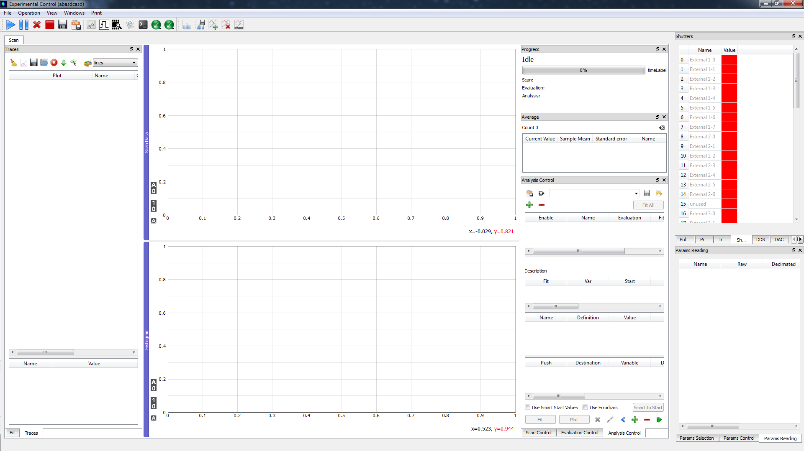
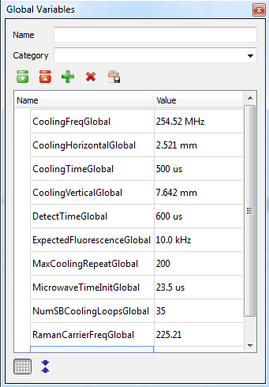

.. include:: inlineImages.include

.. _MainGUI:

Main GUI
========

   The main Experiment GUI

When you first start the program, the main GUI consists of a central area with plot windows surrounded by various control docks, with an action toolbar on top.

Toolbar
-------

The effects of the different toolbar actions are:

|start| -- start a scan
   This will run the scan set in the scan control dock, with the evaulation set in the evaluation control dock. When the scan concludes, it will run the analysis set in the analysis control dock.

|pause| -- pause a scan
   This will pause the scan wherever it currently is.

|stop| -- stop a scan
   This will stop the scan, but will still perform the analysis and register the scan in the :ref`MeasurementLog`.

|abort| -- abort a scan
   This will stop the scan, but will NOT perform the analysis or register the scan in the measurement log.

|DedicatedCounters| -- open the :ref:`DedicatedCounters` window.
   \

|pulses| -- open the :ref:`PulseProgram` window.
   \

|voltages| -- open the :ref:`VoltageControl` window.
   \

|LogicAnalyzer| -- open the :ref:`LogicAnalyzer` window.
   \

|MeasurementLog| -- open the :ref:`MeasurementLog` window.
   \

|Scripting| -- open the :ref:`Scripting` window.
   \

|CheckBox| or |Exception| -- display if an exception occurred
   The |CheckBox| will turn into a |Exception| when an error occurs. If you click on it, you will see a list of all exceptions since the list was last cleared. You can clear the list, or clear individual exceptions.

|CheckBox| or |Warning| -- display if a warning occurred
   The |CheckBox| will turn into a |Warning| when a warning occurs. Interface is the same as for exceptions.

|histogram| -- copy histogram to traces
   This will copy the last histogram from the most recent scan to the trace list together with the other traces. From there it can be saved or viewed later.

|saveHistogram| -- save all histogram from last scan
   This will save every histogram from the most recent scan to a file. It does not create an entry in the trace list. The filename used is specified in the scan control (see :ref:`Scans`).

|addPlot| -- add a plot
   This will add a plot window, which will available for any evaluation.

|removePlot| -- remove a plot
   This will remove an existing plot window. Note: "Scan Data" and "Histogram" (and "Timestamps" if enabled) cannot be removed.

|renamePlot| -- rename a plot
   This will rename an existing plot window. The same plots which cannot be removed also cannot be renamed.

Menu Bar
--------

The menu bar has many of the same options as in the toolbar, with the addition of:

View
   Show or hide any dock widget

Print
   Print (or save to PDF or SVG) any of the plot windows, as configured by the Print Preferences dock.

File > Project Information:
   Show the current project and its configuration settings (see :ref:`Projects` ). Also allows setting the Project Selection GUI and Experiment Configuration GUI on next program start.

File > Save GUI Configuration:
   This will save the current GUI configuration to a new database file with the name "configuration_X.db" (where X=001 on first save, then increments) which will be placed in the day's data directory. This can be used if you want to take a snapshot of your GUI configuration which you can later return to. To reload the GUI configuration: close the program, copy the saved file to '<YourProjectDir>/.gui-config', and rename it 'ExperimentUi.config'.

   Note that this is only for taking a snapshot to return to. Ordinary saving of the GUI configuration happens automatically once a minute, and whenever the program is closed.

File > Save Settings:
   This will save experiment configuration data to a file in the day's data directory, in a human-readable (XML) format. This is useful for taking a snapshot of settings which can later be return to, or for moving settings between projects.

File > Load Settings:
   Load specific experiment configuration data from a file saved via File > Save Settings. Options:

      - **Add**: add any missing elements, without modifying existing elements.
      - **Update**: add any missing elements, and modify existing elements based on the file. Do not delete anything.
      - **Replace**: completely replace existing settings with settings in file.

Docks
-----

All of the control and information windows in the main GUI are divided into the following docks:

FPGA Control Docks
~~~~~~~~~~~~~~~~~~

- Shutters
- Triggers
- DDS
- DAC
- Pulser Parameters

see :ref:`FPGAControl` for information on all of these docks.

Scan Control Docks
~~~~~~~~~~~~~~~~~~

- Scan Control
- Evaluation Control
- Analysis Control
- Traces
- Fit
- Progress
- Average
- Todo List

see :ref:`Scans` for information on all of these docks.

External Parameters Docks
~~~~~~~~~~~~~~~~~~~~~~~~~

- Params Selection
- Params Control
- Params Reading

see :ref:`ExternalParameters` for information on all of these docks.

Value History Dock
~~~~~~~~~~~~~~~~~~

.. figure:: ../images/ValueHistory.png
   :scale: 100 %

   Value History Dock

   Allows querying the history associated with a specific value. History is shown in a table. To update the table, click |revert|. This same information can also be plotted using the :ref:`Instrument Logger <InstrumentLogger>`.

Global Variables Dock
~~~~~~~~~~~~~~~~~~~~~

   Global Variables Dock

Global variables can be referenced in many places throught the program, and allow different parts of the program to reference the same value. The global variables dock shows all current global variables. To add a global variable, type a name in the "Name" box and hit enter or click |add|. The are no specific naming requirements, however, to avoid namespace collisions with the pulse program, I tend to end all global variables with the word "Global." (If you have a pulse program variable "CoolingFreq" and a global variable by the same name, this will likely cause problems and at the very least confusion.)

Global variables can be categorized and displayed in a tree structure to make it easier to keep them organized. This has no effect on the global variable's behavior in the program, it is purely a visual tool. To categorize a global variable, right click on the global and select from the "Categorize" menu. You can also add a global to a category on creation by using the "Category" text field/drop down menu.

Global variables can be made bold by selecting the variable and hitting CTRL-B, or have a different background color by right clicking and selecting "background color". This has no effect on the program, it simply makes that global variable easier to find quickly in the list.

The |grid| button controls whether a grid is shown, and the |condense| button controls how densely the global variables are displayed.

Console Docks
~~~~~~~~~~~~~

- Console Output
   Displays console output. If IDE is being used, IDE console will show the same information

- Logging
   Enables granular control over what information is logged to the console

Print Preferences Dock
~~~~~~~~~~~~~~~~~~~~~~

   Settings for printing. Can also be shown via the print menu.

Optional Docks
~~~~~~~~~~~~~~

- Timestamp Traces
   Will only be visible if timestamps are enabled. See :ref:`Timestamps` .

- AWG
   Will only be visible if AWG is enabled. See :ref:`AWG` .

Plot Windows
~~~~~~~~~~~~

- Hovering over any of the plot windows shows the coordinates of the cursor in the lower right.
- The plot windows can be clicked and dragged, or zoomed by scrolling.
- Right clicking shows a number of display options.
- All plot windows have three buttons in the lower left:

  |auto| - Autoscale the plot

  |zeroToAuto| - Hold the y-axis minimum at zero, and autoscale the maximum

  |zeroToOne| - Hold the y-axis minimum at zero, and the maximum at one