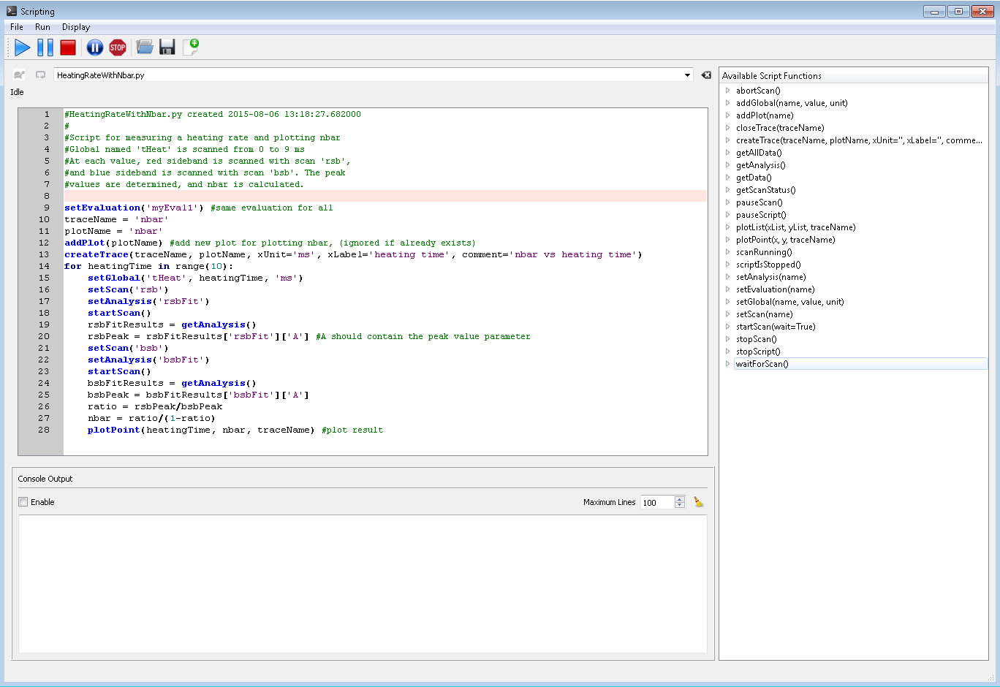

.. include:: inlineImages.include

.. _Scripting:

Scripting
=========

The scripting functionality allows you to write Python scripts that can directly control (and read from) the rest of the program with simple commands. This allows the creation of complex experimental sequences such as multi-dimensional scans, conditional calibration sequences, averaging, or really whatever you can come up with.

   The scripting interface

The available script commands are listed on the right hand side, together with documentation. In addition, all normal Python functionality is available. The console output shows console messages pertaining to the script only.

The buttons do the following:

|start| - start the script

|pause| - pause the script

|stop| - stop the script

|circlepause| - pause the script and the scan, if one is running

|stopsign| - stop the script and the scan, if one is running

|open| - open an existing script

|save| - save the script (CTRL-S)

|new| - create a new script

|turtle| - add a 0.4 s delay between each script command (potentially useful for debugging)

|continuous| - run the script in a loop (i.e. restart when it finishes)

There are a number of example scripts in IonControl\\config\\Scripts.

.. warning:: If a script contains an infinite loop (or a potentially infinite loop), you must include the following lines in the loop:

   .. code-block:: Python

      if scriptIsStopped():
          break

   If you do not, and the loop is infinite, you will be unable to stop the script without stopping the whole program.

Available script functions
--------------------------

.. autoclass:: scripting.Script.Script
    :members:
    :private-members:
    :exclude-members: run, emitLocation, scriptFunction
    :noindex:
